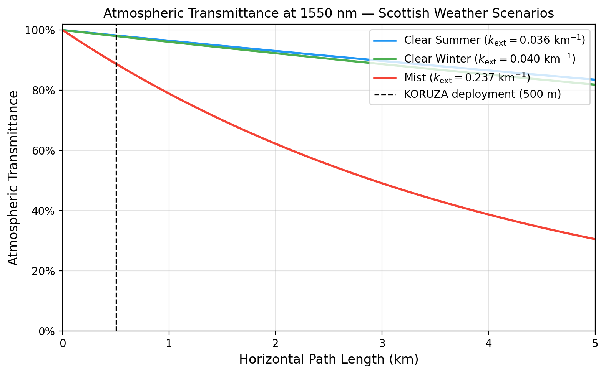
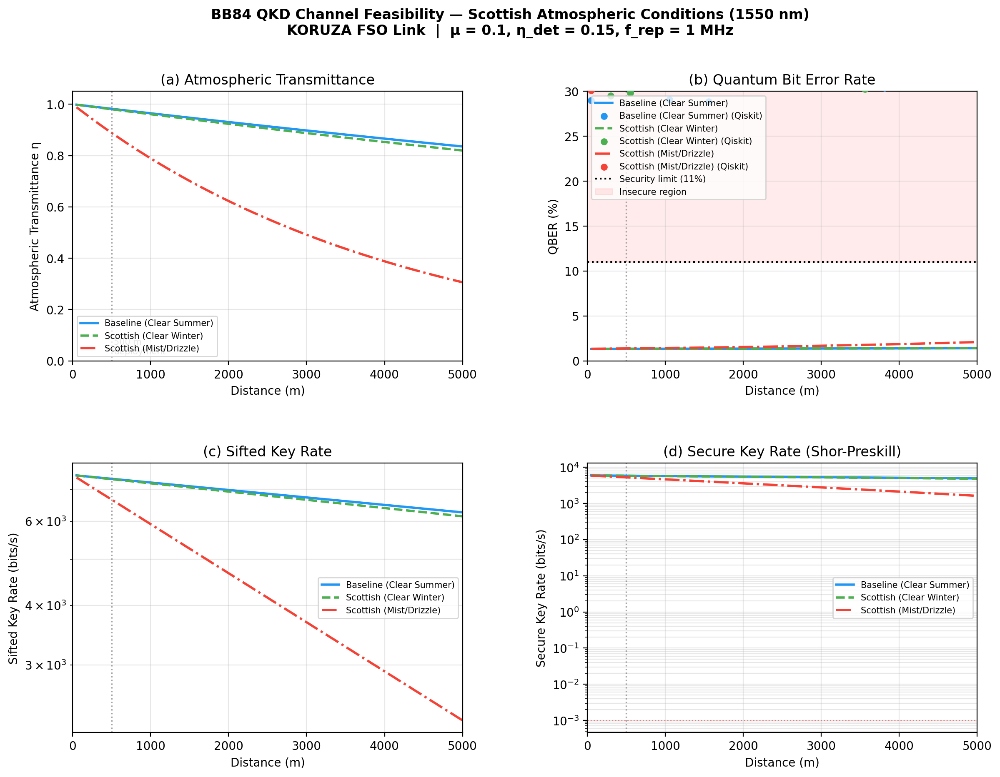
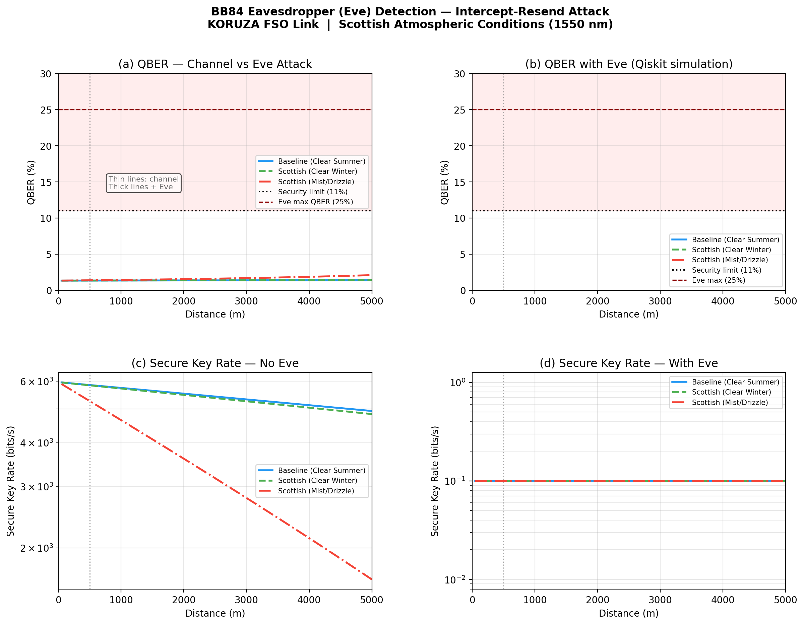
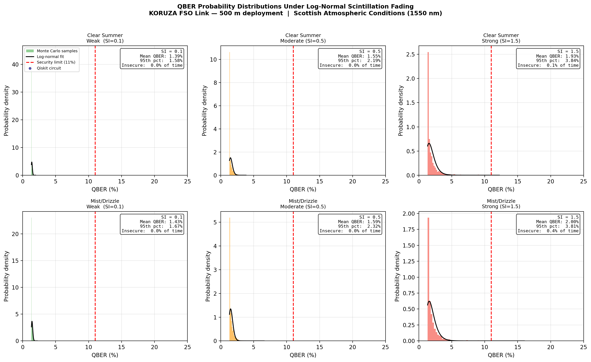

# KORUZA FSO-QKD — 4th Year Research Project

**Experimental Characterisation of a Terrestrial Free-Space Optical Link for Quantum Key Distribution**

Todd Blacklaw — Heriot-Watt University, B.Sc. Physics, Year 4 
*Supervisor: Alessandro Fedrizzi*

---

## Overview

This repository contains everything produced for my 4th year research project, which investigates whether a low-cost, open-source free-space optical (FSO) terminal can serve as a viable platform for quantum key distribution (QKD) under real Scottish atmospheric conditions.

The project has three parts:

1. **Hardware** — A modified [IRNAS KORUZA](https://www.irnas.eu/koruza/) FSO terminal, replacing the original custom PCB with a Raspberry Pi and off-the-shelf components. The Pi code and hardware setup lives in the [`koruza-pi`](https://github.com/Toddb2/koruza-pi) submodule.

2. **Atmospheric modelling** — The atmospheric extinction coefficient at 1550 nm is computed for three Scottish weather scenarios (clear summer, clear winter, mist) using libRadtran Monte Carlo radiative transfer simulations. Scripts live in the [`Libradtran-HW`](https://github.com/Toddb2/Libradtran-HW) submodule.

3. **Quantum channel simulation** — Three Qiskit simulations propagate the atmospheric transmittance through a BB84 QKD model: a channel feasibility study, an eavesdropper detection model, and a log-normal scintillation fading analysis.

**Key result:** At 500 m, all Scottish weather scenarios support secure QKD with QBER of 1.34–1.38% and secure key rates of 5.3–5.9 kbps — well within the 11% Shor–Preskill security threshold. An intercept-resend eavesdropper is unambiguously detectable, raising QBER to ~40%.

---

## Repository Structure

```
4th-year-project---KORUZA-FSO-QKD/
│
├── README.md
├── requirements.txt
│
├── dissertation/
│   ├── Blacklaw_dissertation_draft.pdf   ← full report (read this first)
│   └── dissertation.tex                  ← LaTeX source
│
├── atmospheric-modelling/
│   ├── Libradtran-HW/                    ← submodule (libRadtran scripts)
│   └── figures/
│       └── Scottish_Transmission_Comparison.png
│
├── qkd-simulations/
│   ├── qkd_bb84_simulation.py
│   ├── eve_attack_simulation.py
│   ├── scintillation_simulation.py
│   └── figures/
│       ├── BB84_QKD_Scottish_Scenarios.png
│       ├── BB84_QBER_vs_Transmittance.png
│       ├── Eve_Attack_BB84_FSO.png
│       ├── Scintillation_QBER_Distributions.png
│       └── Scintillation_Distance_Sweep.png
│
└── hardware/
    ├── koruza-pi/                         ← submodule (Raspberry Pi code & config)
    ├── KORUZA_RPi_shieldBillOfMaterials.xls
    └── KORUZA_RPi_shield.PDF
```

---

## Results Summary

### Atmospheric Transmission at 1550 nm

| Scenario | k_ext (km⁻¹) | η @ 500 m | η @ 1 km | Dominant loss |
|---|---|---|---|---|
| Clear Summer | 0.036 | 98.2% | 96.4% | Aerosol (Mie) |
| Clear Winter | 0.040 | 98.0% | 96.1% | Aerosol (Mie) |
| Mist/Drizzle | 0.237 | 88.8% | 78.9% | Strong Mie |



---

### BB84 QKD Feasibility at 500 m

| Scenario | QBER (%) | Sifted rate (bps) | Secure rate (bps) |
|---|---|---|---|
| Clear Summer | 1.34 | 7366 | 5856 |
| Clear Winter | 1.34 | 7352 | 5844 |
| Mist/Drizzle | 1.38 | 6663 | 5267 |

*System parameters: μ = 0.1, η_det = 0.15, f_rep = 1 MHz, dark count rate = 100 s⁻¹*



---

### Eavesdropper Detection

A full intercept-resend attack raises QBER from ~1.4% to ~40% at 500 m — 29 percentage points above the 11% security threshold, making Eve unambiguously detectable.



---

### Scintillation Fading

| Scenario | Turbulence (SI) | Mean QBER (%) | 95th pct (%) | Insecure fraction (%) |
|---|---|---|---|---|
| Clear Summer | 0.1 (weak) | 1.40 | 1.58 | 0.00 |
| Clear Summer | 0.5 (moderate) | 1.55 | 2.19 | 0.00 |
| Clear Summer | 1.5 (strong) | 1.93 | 3.84 | 0.10 |
| Mist/Drizzle | 1.5 (strong) | 2.00 | 3.81 | 0.40 |



---

## Getting Started

### Clone the repo (including submodules)

```bash
git clone --recurse-submodules https://github.com/Toddb2/4th-year-project---KORUZA-FSO-QKD.git
cd 4th-year-project---KORUZA-FSO-QKD
```

If you already cloned without `--recurse-submodules`:
```bash
git submodule update --init --recursive
```

### Install Python dependencies

```bash
pip install -r requirements.txt
```

### Run the simulations

Each script is self-contained and produces its own figures:

```bash
# BB84 channel feasibility
python qkd-simulations/qkd_bb84_simulation.py

# Eavesdropper detection
python qkd-simulations/eve_attack_simulation.py

# Scintillation fading analysis
python qkd-simulations/scintillation_simulation.py
```

### Atmospheric modelling

The libRadtran simulations require a local installation of [libRadtran](http://www.libradtran.org/) (version 2.0.6). See the [`Libradtran-HW`](https://github.com/Toddb2/Libradtran-HW) submodule for setup instructions and scripts.

---

## Hardware

The terminal is based on the open-source [IRNAS KORUZA](https://www.irnas.eu/koruza/) design with the following modifications:

- Custom KORUZA PCB replaced with a **Raspberry Pi 2B** and off-the-shelf components
- Stepper motors driven by **ULN2003 Darlington array** directly from GPIO pins (no dedicated motor controller)
- Optical data link via **TP-Link MC220L** media converter and standard SFP transceiver at 1550 nm
- 3D printed housing in PLA following original KORUZA mechanical drawings

Full Raspberry Pi code, wiring config, and setup instructions are in the [`koruza-pi`](https://github.com/Toddb2/koruza-pi) submodule. The bill of materials and shield schematic are in `hardware/`.

---

## Dissertation

The full dissertation is available as a PDF in `dissertation/`. It covers:

- Atmospheric turbulence theory (Kolmogorov cascade, log-normal and Gamma-Gamma models)
- FSO channel characterisation (Beer-Lambert law, extinction coefficients, scintillation)
- BB84 QKD protocol, Shor-Preskill security bound, QBER analysis
- libRadtran Monte Carlo atmospheric modelling methodology
- Qiskit amplitude-damping channel simulation methodology
- Full results and discussion for all three Scottish weather scenarios
- Proposed hardware modifications to implement single-photon BB84 QKD

---

## Dependencies

| Package | Version | Purpose |
|---|---|---|
| qiskit | 2.3.0 | Quantum circuit simulation |
| qiskit-aer | latest | Noise model backend |
| numpy | latest | Numerical computation |
| scipy | latest | Statistical fitting |
| matplotlib | latest | Plotting |
| pandas | latest | Data handling |

---

## Acknowledgements

Thanks to Alessandro Fedrizzi (Heriot-Watt University) for supervision, and to Faris Redza (PhD candidate, HWU) for technical support during hardware construction.

The [libRadtran](http://www.libradtran.org/) software package is maintained by Ludwig Maximilian University of Munich and the Norwegian Institute for Air Research. The [Qiskit](https://qiskit.org/) framework is maintained by IBM. The [KORUZA](https://www.irnas.eu/koruza/) platform is developed by IRNAS.

---

## Licence

This project is released for academic and educational use. The simulation code is MIT licensed. The dissertation text is copyright Todd Blacklaw, Heriot-Watt University, 2026.
